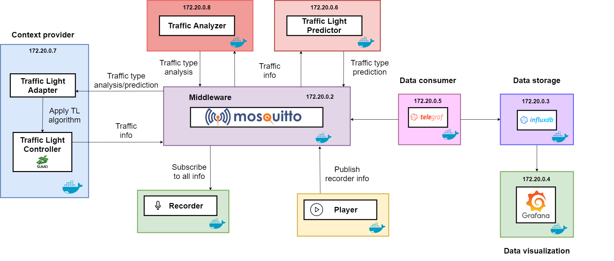

# SmartTLC framework
The Smart Traffic Light Control framework for Urban Environments allows comparing different traffic light 
adaptation approaches to help designers decide which one performs better in different situations.

The metric used to compare between the different adaptation approaches is the waiting time per vehicle on each 
direction.

## Basic concepts

Before going deeper into the different components and architecture, we are going to describe some relevant concepts 
to understand this framework better.

### What is Eclipse SUMO?

["Simulation of Urban MObility" (SUMO)](https://sumo.dlr.de/) is an open source,
highly portable, microscopic traffic simulation package designed to handle large road networks and different modes of 
transport. It is available on [GitHub](https://github.com/eclipse/sumo).

### What is TraCI?

TraCI is the short term for "**Tra**ffic **C**ontrol **I**nterface". Giving access to a running road traffic simulation,
it allows retrieving values of simulated objects and manipulating their behavior "on-line".

TraCI uses a TCP based client/server architecture to provide access to sumo. Thereby, sumo acts as server. Please note, 
when sumo runs as a TraCI server, it runs until the client demands a simulation end.

Documentation is available on [Eclipse SUMO TraCI webpage](https://sumo.dlr.de/docs/TraCI.html).

## Architecture
The architecture is described in the next figure:



Where it can be seen that most of the components have an IP direction, in order to connect between them.

### Components
- Context providers such as:
  - **Traffic Light Controller**: traffic simulator used to monitor the traffic contextual information in a temporal 
    window, for example of 5 minutes. It uses 
    [Eclipse SUMO simulator]
  - **Traffic Light Adapter**: component to select the best traffic algorithm based on the information provided by the 
    TLP and TA (described below).
- **Middleware**: publish-subscribe middleware to exchange information along the system. It uses the MQTT protocol, and 
  the [Eclipse Mosquitto] broker.
- **Traffic Analyzer**: analyze the current vehicle flows based on the contextual information provided by the TLC.
- **Traffic Predictor**: it is composed by several machine learning models that will predict the traffic flows 
  based on two different approaches.
  - Using contextual information such as the number of vehicles passing, and the current date-time.
  - Using only date-time information.
- **Recorder (optional)**: Python script that stores all the information related to a given component in an experiment, 
  in order to reproduce it in the future.
- **Player (optional)**: Python script that reproduced a previously recorded experiment.
- **Data Metrics Consumer**: it gathers all the system information and parse it in order to store it into the database. 
  This component uses [Telegraf], which is part of the 
  [TICK stack].
- **Data Storage**: a temporal database where the parsed information will be stored. It is used 
  [InfluxDB] as it is also part of the TICK stack.
- **Data Visualization**: provides tools for creating graphics and charts with the information stored in the database. 
  The tools used is [Grafana].
  
Note: some previous components are deeply described on the README.md stored on their respective folders.

## Installation

It requires [Docker] and [Docker-compose] in order to deploy the full architecture, and it is also required the 
[Anaconda] platform. All the installations are available on the following links:

- [Anaconda installation]
- [Docker installation]
- [Docker-compose installation]

Before following with the usage and deployment of the architecture, it is explained the creation of a Conda environment
where all the SmartTLC dependencies will be installed. In order to create this environment execute the next command when 
Anaconda has been installed successfully.

```sh
# Create conda environment
conda create --name smarttlc --file ./requirements.txt
# Activate conda environment
conda activate smarttlc
```

## Usage
Once the required software is installed, we are now going to describe the user guide, which is divided into two 
different aspects: (1) docker-compose file generation, (2) architecture deployment and (3) examples execution.

### Docker-compose file generation
The Docker architecture specification is made using the docker-compose specification. In order to achieve 
this, a simple script has been developed, where the input values are the name of the containers that are going to be 
generated on the output specification file. This file is available at the *'utils/docker_generator/'* folder y can be 
executed as follows:

```sh
python main.py -c <containers>
```

The possible containers are those presented on the architecture, and must be separated by a comma (‘,’):
- mosquitto
- influxdb
- grafana
- telegraf
- traffic_light_predictor_date
- traffic_light_predictor_context
- traffic_light_controller
- traffic_analyzer
- recorder
- player

The most relevant fact about this generator is that it also generates the container links and dependencies, so the 
final user does not need to be aware of those kinds of facts. The generated file will be saved on the root project 
folder, where all the containers are store in different folders, with the name **“docker-compose.yml”**. 

### Architecture deployment
Once the docker-compose specification has been generated, we can deploy the full architecture or at least the specified 
components on the generator. In order to achieve this, we are going to execute the following command, in the project 
root folder:

```sh
sudo docker-compose up
```

### Architecture clean up
Once the user wants to stop all the architecture’s containers and clean up them, there is a shell script which allows 
to perform this process easily, just executing the following command, in the project root folder:

```sh
./utils/clean_up_containers.sh
```

### Example execution
In the folder "examples" there are defined several shell scripts that allows to perform different examples based on 
three different time patterns: (1) one day time pattern, related to a Monday; (2) interval of three days time pattern; 
and (3) random time pattern. These examples are created to check the behavior of the system and its adaptation based on 
contextual traffic information. 

In this case, there have been defined four different approaches:
- No adaptation ("example_no_adaptation.sh")
- Using only date-based predictor ("example_prediction_date_adaptation.sh")
- Using only real-time analyzer ("example_analyzer_adaptation.sh")
- Combining both real-time analyzer and context-based predictor ("example_analyzer_prediction_context_adaptation.sh")

In order to execute each one of the examples, execute the next command:

```sh
# For example the one day (Monday) time pattern with no adaptation
./examples/monday/example_no_adaptation.sh
```

## Suggestions
If you have any suggestion to improve the SmartTLC framework, do not hesitate and open an issue or even email me
at [joserralp@unex.es](mailto:joserralp@unex.es?subject=[GitHub]%20SmartTLC%20Suggestion).

## License
[MIT](https://choosealicense.com/licenses/mit/)

[Docker]: <https://www.docker.com/>
[Docker-compose]: <https://docs.docker.com/compose/>
[Eclipse SUMO simulator]: <https://www.eclipse.org/sumo/>
[Eclipse Mosquitto]: <https://mosquitto.org/>
[Telegraf]: <https://www.influxdata.com/time-series-platform/telegraf/>
[TICK Stack]: <https://wiki.archlinux.org/title/TICK_stack>
[InfluxDB]: <https://www.influxdata.com/>
[Anaconda]: <https://www.anaconda.com/>
[Grafana]: <https://grafana.com/>
[Anaconda installation]: <https://docs.anaconda.com/anaconda/install/index.html>
[Docker installation]: <https://docs.docker.com/engine/install/ubuntu/>
[Docker-compose installation]: <https://docs.docker.com/compose/install/>
